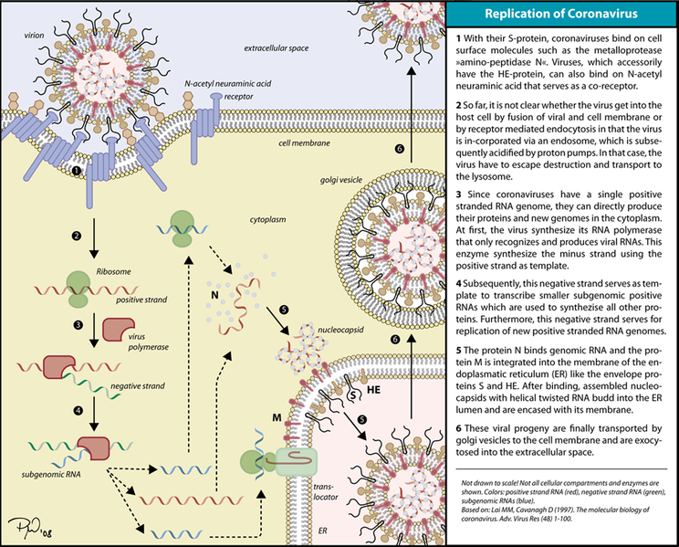
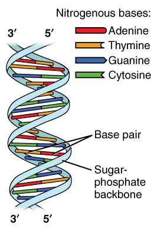

# Coronavirus Notes

[Original Article](https://creativedestructionmedia.com/news/asia/2020/02/16/report-chinese-scientist-who-worked-at-unc-finds-killer-coronavirus-probably-originated-from-a-laboratory-in-wuhan/?fbclid=IwAR0S4UjubgvM2zwwQ9sATbmXOa1aUUPim68ndhsvwGlUYLTFE1oaVdw1xoI)

## Relative Sizes of Things
Atoms -> Molecules -> Amino Acids -> Proteins (these things)
A cell is made up of many things. The things that are important are the cell membrane, 

## Step 1
S-protein: The receptors on the surface of the flu virus. The black lines that look like pinchers on the virus.
N-acetyl neuraminic acid is a co-receptor that will bind to the S-protein on the virus. 
Accessorily (HE-protein) - TODO: What is this?

## Step 2
The cell membrane is labeled in the picture with two lines with yellow dots with squigglies. 

### Phospholipid Bilayer

That's really called a phospholipid bilayer. That layer is the basic membrane that encases all animal cells. It is made up of two layers of phospholipids. With each phospholipid molecule, there is one end that is hydrophobic and one end that is hydrophillic. It is the hydrophobic end that attracts each other and points inward. That creates the bilayer. This gives you a waterproof membrane for the cell. Within the phosopholipid bilaer (cell membrane) there will be various receptors or special channels depending on the type of cell it is. These receptors can cause the cell to do different things. The channels can let in big molecules or ions - various materials. That's how things enter and exit the cell and how the cell communictaes with cells around it.

Note: Plants have cell walls and animals have cell membranes.

### Proton pumps 

They are tiny, cellular, appartuses which pump protons or hydrogen ions into the endosome in an attempt to destroy the virus.

Lysosome - to lys something means to destory things. So a lysosome is something that destroys something else.

What the picture is saying is that they don't know how the virus avoids this destruction.

### Explanation

What the picture is saying is that the S-protein binds to one of the cell membranes. It's not clear whether the viral membrane fuses to the cell membrane or if a portion of the cell membrane envelops the virus particle (endocytosis).

Viruses are incorporated in a endosome. An endosome is a little envelope of cell membrane that surrounds the virus.

## Step 3

TLDR - Ribosomes, DNA, and RNA: DNA uses RNA to tell Ribosomes how to create amino acids which then create proteins.

### Nitrogenous Base (Nucleotide)

#### Ribosome

Ribosomes (named also Palade's corpuscles) comprise a complex macromolecular machine, found within all living cells, that serves as the site of biological protein synthesis (translation). Ribosomes link amino acids together in the order specified by messenger RNA (mRNA) molecules. Ribosomes consist of two major components: the small ribosomal subunits, which read the mRNA, and the large subunits, which join amino acids to form a polypeptide chain

#### DNA vs RNA

- DNA contains the sugar deoxyribose, while RNA contains the sugar ribose. The only difference between ribose and deoxyribose is that ribose has one more -OH group than deoxyribose, which has -H attached to the second (2') carbon in the ring.
- DNA is a double-stranded molecule, while RNA is a single-stranded molecule.
- DNA is stable under alkaline conditions, while RNA is not stable.
- DNA and RNA perform different functions in humans. DNA is responsible for storing and transferring genetic information, while RNA directly codes for amino acids and acts as a messenger between DNA and ribosomes to make proteins.
- DNA and RNA base pairing is slightly different since DNA uses the bases adenine, thymine, cytosine, and guanine; RNA uses adenine, uracil, cytosine, and guanine. Uracil differs from thymine in that it lacks a methyl group on its ring.

#### Nitrogenous Base Explained

**Picture of DNA (deoxyribonucleic acid)**

*Note*: RNA would be one strand instead of the two paired together.

There are five types of nitrogenous bases. Each of these pair up. These make up DNA and RNA.

- adenine (A)
  - Always pairs with T
  - Pairs with T and U
- uracil (U)
  - Always goes with G
  - Only in RNA
- guanine (G)
  - Always goes with C
- thymine (T)
  - Only present in DNA
  - Pairs with A
- cytosine (C)
  - Pairs with G

Looking at the picture, you can see if you were to unzip each one of those strands, each would provide the template for the other. That is to say, because of how the nucleotides pair together, if you were to separate the two sides, the only way to recombine them would result in the original configuration.

By unzipping one portion of DNA, you get a separated strand which can create RNA.

Each set of three nitrogenous bases encode for one amino acid. There are [20 amino acids](http://www.cryst.bbk.ac.uk/education/AminoAcid/the_twenty.html).

#### Enzyme

Enzymes catalyze biologic, chemical, reactions. They take something that wouldn't happen usually, or would happen too slowly to be useful, and make it happen more quickly. You can always tell when something is an enzyme because it ends in the suffix *ase*.

#### Polymer

A polymer is a long string of molecules - like RNA.

#### Genome

All the genetic code together.

### Explanation

> "Since coronaviruses have a single positive stranded RNA genome, they can directly produce their proteins and new genomes in the cyptoplasm."

What this is saying is that instead of carrying around DNA, which encodes for RNA, which encodes for proteins, the coronavirus just carries around a strand of RNA which encodes for the instructions for all the proteins it needs.

Once it enters the cell it hijacks a ribosome and uses that to first synthesize its RNA polymerase. RNA polymerase is going to help make RNA faster from the ribosomes hijacked by the virus. Now it can make copies of its genome.

> This enzyme synthesizes the negative strand using the positive strand as a template

## Step 4

Since the virus is carrying around the positive strand, when it gets to a cell it needs to make more negative strands which allows it to create positive strands (a copy of its genome) and these also create amino acids which make proteins (those comprise its shell, that s-protein from the beginning, etc).

So the negative strand is the mirror image of the positive strand. The negative strand in this case is the one that's going to be used to make the amino acids. It also serves as the template for replication of new positive stranded genomes.

## Step 5

### Eukaryote

Eukaryotes are organisms whose cells have a nucleus enclosed within membranes, unlike prokaryotes (Bacteria and Archaea), which have no membrane-bound organelles.

### Endoplasmatic Reticulum

TODO Need to come back to.

### Explanation

Basically its using the endoplasmatic reticulum and all those proteins that it has made to form a new virus particle. You can see this in the picture.

## Step 6

Go forth, conquor new virus particles.
