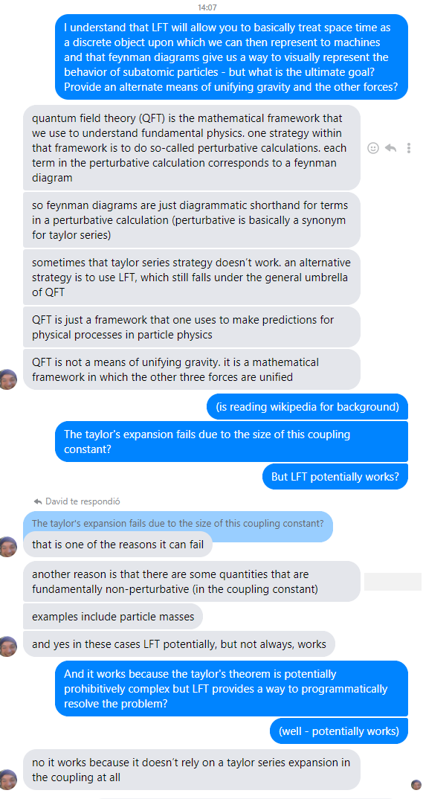
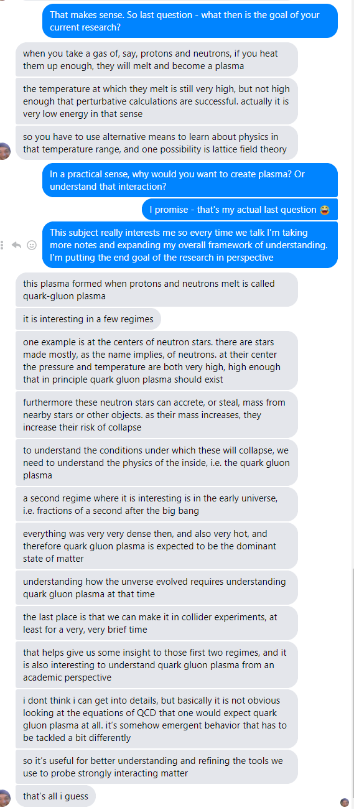

# La Fisica General y La Teoria de Campo Latice

- Sabemos que la material oscura tiene que existir porque podemos observar el regreso do los fotonos y ver que con la masa del objecto y la influencia de la gravidad, hay que existir otra fuerza que esta actuando en el cuerpo. Llamamos esta frueza producida la fuerza oscura y la material que la produce material oscura
- Hay cuatro fuerzas fundamentales en el universo: la fuerza nuclear debil, la fuerza nuclear fuerte, gravidad, y electromagnetico
- Gravidad es el producto de la interactuacion de gravitrones entre si. Dos masas cuando estan cerca conocen la existencia de la otra mediante estas gravitrones
- Un particulo elementario es un particulo que actualmente desconocemos otro particulo mas pequeno
- Gluones, llamados asi por su propiedad de attrear el uno y el otro, son responsables para mantener la estructura de los protones y los neutrones
- La responsibilidad de la frueza debil nuclear es la frueza que gobierna la declive do particulos nucleares
- Quantum Field Theory: In theoretical physics, quantum field theory (QFT) is a theoretical framework that combines classical field theory, special relativity and quantum mechanics.[1]:xi QFT is used in particle physics to construct physical models of subatomic particles and in condensed matter physics to construct models of quasiparticles.
- El modelo estandard unifica tres de las quatro fruezas: la fuerza electromagnetico y la fuerza debil y fuerte nuclear
- Unified Field Theory es la idea de buscar la relacion matimatica entre la gravidad y las otras fuerzas
- Las ondas con una frecuencia mas alta requiren mas energia de generar.
- La razon por la que la fisica de alta energia esta en problemas es hemos hecho el siguiente:
  - Hemos usado modelos matematicas imperfectos continuamente para encontrar particulos usando lo que nos llamamos "symmetries" para unificar todas las fuerzas dejando al lado la gravidad
  - Usando estas metodos esta basado en la habilidad de eliminar partes de "infinidad" en las ecuaciones
  - El problema es que un tio ha probado que esta metodo no es posible que la gravidad. Nos quedamos en problemas porque require un monton de energia de comprobar "TODO"
- La teoria de campo latice es especial porque un tio, en vez de presumir que el espacio tiempo continuo es en realidad continuo, presumo que es descreto. Entonces esta usando la estatistica para modelarlo y para mi, la parte mas relevante es que se puede usar un ordenador para trabajar con ello
- t'hooft aprobó que no se puede usar las tecnicas previamente usadas para unificar los campos: "quantum theories of gravity are not renormalizable"

##　Machine Learning and Lattice Field Theory

this is an area of active research in lattice QCD, and something i am not yet qualified to work on
to give you a taste, there are sort of at least two problems to which machine learning can be applied in lattice QCD
1. generation of configurations. if you remember, i told you that the way my research works is that we sort of create "snapshots" of finite size systems called configurations. quantities of interest, let's say for example a particle mass, are then measured on these configurations. the standard approach for generating a configuration is to use markov chains
so if we're already using markov chains, why bother with machine learning? well markov chains in this context have a few limitations that ML might help with. off the top of my head, the chains suffer from a phenomenon called "critical slowing down"
to put it roughly, critical slowing down means that the more physically realistic a system gets (more precisely the smaller the lattice spacing gets), the more expensive it is to generate a configuration
the price becomes absurdly steep; the computing time scales exponentially
this also really sucks because one generally needs a large number of configurations to measure the quantity of interest properly. right now i am working on an observable whose error bar 20%, even after 20*16000 configurations. for some observables we have generated millions
(observable = quantity of interest, sorry to switch jargon, it's a habit)
so, the hope is that one can hugely reduce this computing time by generating a large training set of configurations. the neural net then gives you back more configurations for a (comparatively substantially) reduced computational cost, as many as your heart desires
as i understand it this application of ML to lattice QCD is still under development
2. identification of phase transitions.
you are aware that if you take water and heat it up enough (at atmospheric pressure) it begins to boil, i.e. the water changes from liquid to gas. in physics 'liquid' and 'gas' are often called 'phases' of matter, and the phenomenon by which water turns from liquid to gas is called a 'phase transition'
a modern perspective to understand phase transitions is to look out symmetries that the system inherently possesses. as you adjust some parameter (say, the temperature), the symmetry disappears or 'breaks'; we call this phenomenon 'spontaneous symmetry breaking'
associated to each symmetry there is an 'order parameter'. order parameters are zero in one phase and nonzero in the other, and the change of an order parameter signals the spontaneous breaking (or restoration) of its associated symmetry
that is all well and good, except that some systems do not have an easily identifiable symmetry or order parameter, even though they clearly change phases
